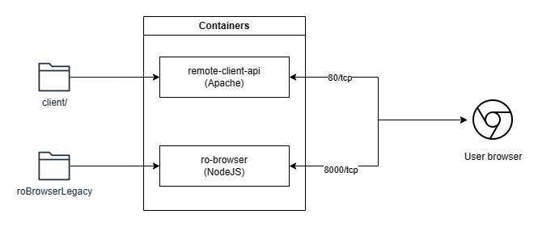
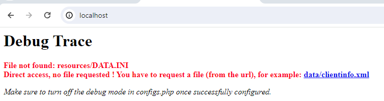
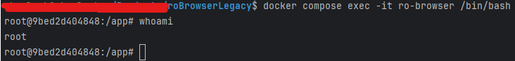

# Setting up the environment

## Docker 

This should apply to any environment running [OCI](https://opencontainers.org/) compatible software, but we recommend using
Docker for the easy of use and extensive documentation and guides out there to help you set up your environment.

This document assumes that you already have a Docker environment running and capable of running containers.

The [Dockerfile](../Dockerfile) contains the recipe for the two images needed for the containers: the Apache Web Server image
and the Node image. The Apache Web Server is used to serve the assets when they are ready to use, also serving the [Remote Client API](../client), and the Node image is used to develop and compile the roBrowser client files.

The [docker-compose.yaml](../docker-compose.yaml) file contains the orchestration of the containers that will be used to run the project.
The containers will be serving different folders on the project. The remote-client-api container will be mapped to serve the [client](../client) folder and its files.
The Node container will be serving the whole roBrowserLegacy folder, meaning you can browse the files withing the container and move things around when developing:



### Using docker compose

#### Remote Client API service

To start the services using docker compose, just run the following command:

```bash
docker compose up -d
```

The services should be up in about 15 seconds. You can follow up the status with the command:

```bash
docker compose ps
```

After running up the containers, go to the [client/configs.php](../client/configs.php) file and change the following configuration:

```php
'DEBUG'               =>     false,
```
to
```php
'DEBUG'               =>     true,
```

Save the file and access the http://localhost. You should see a debug screen if some information:



This text informs us that are no files present to be served by the script. Check the [](./GettingStarted.md#preparing-the-dependencies) for the needed set-up, example:


#### roBrowser client

To start using this service, just execute the following command on your terminal window:

```bash
docker compose exec -it ro-browser /bin/bash
```

You should get access to the container terminal.  Here you can execute any npm commands that you needed. The source code of the project is located in the **/app** directory. 
Also, worth noting that the current user does not have root permissions, so if you need to install anything on the system, you should modify the service block to:

```yaml
  ro-browser:
    build:
      context: .
      dockerfile: Dockerfile
      target: client
    ports:
      - "8000:8000"
    volumes:
      - ./:/app
    tty: true
    user: "0:0" # Add this to run the container with the root user.
    command: ['sleep', '360h']
    networks:
        - "ro-browser"
```

Run ```docker compose down``` and after that ```docker compose up -d``` again. After that, enter the container terminal to see the change:



TODO: Add the setup using the host machine (maybe in a VM environment.)
