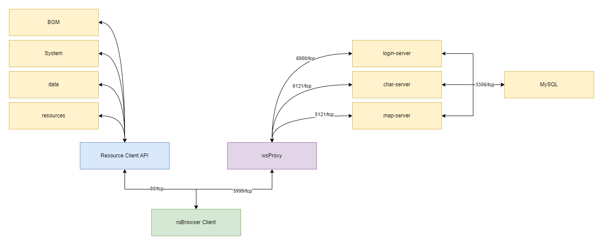

# Getting started

This document assumes that you already set up your environment to run it. If not check out the [Environment](./Environment.md) page before using this guide.

This project has two components: the [Remote Client API](../client) and the [roBrowser client](../src). The Remote Client API is responsible for
serving the game client assets for the roBrowser client, but the roBrowser client also supports loading the files directly from the browser window.

The roBrowser also needs to communicate with the game server emulator via WebSockets, you can use the [wsProxy](https://github.com/herenow/wsProxy#readme) to this purpose.

The final communication layout can vary according to your setup, but a production environment should look like:



## Setup roBrowser client

There are many ways to use this client, but the most basic will be covered in this document. You can check out the [Advanced client usage guide](AdvancedClientUsage.md) for more ways to implement the client.

To start, open the file [tools/builder-web.js](../tools/builder-web.js) file and search for the ```window.ROConfig``` variable. You can check out the [full configuration overview,](README.md#7-robrowser-settings-overview)
but we will only change the necessary configuration:

```js
remoteClient:  "http://roclient.localhost/" //or ""
```

Set this property to the address where the Remote Client API is accessible (from the user browser perspective).

* [Set up a self-hosted Remote Client API](./RemoteClientAPI.md#self-hosting-the-remote-client-api)
* [Using an existing Remote Client API](./RemoteClientAPI.md#list-of-remote-client-apis)
* [Upload files from local disk via browser](#TODO)

Set the value to "" if you intend to use the local disk files.

Next, set up the login-server address, example:
```js
address: '127.0.0.1',
```

> [!NOTE]  
> The address should be accessible by the char-server and map-server. It does not need to be externally accessible.

Next, set up the packetver value from your server. You should get this from the emulator server that you're trying to access. Example: 
```js
packetver: 20180704,
```

And finally, set up the websocket proxy address. This is the only entrypoint that is needed for the roBrowser client, example:

```js
socketProxy: "ws://127.0.0.1:5999/",
```

### Preparing the dependencies

Before compiling, copy all the files in the AI directory from the official game client to the AI directory from the project root.

> [!IMPORTANT]  
> You should change the import declaration in the LUA files to work properly with the roBrowser.

To do this, after copying the files you can run this command on a terminal window:

```bash 
sed -i 's@require "AI\\\\Const@dofile "./AI/Const.lua@;s@require "AI\\\\Util@dofile "./AI/Util.lua@' ./AI/*.lua
```
OR replace it manually with a text editor:
* Replace all `require "AI\\Const"` with `dofile "./AI/Const.lua"`
* Replace all `require "AI\\Util"` with `dofile "./AI/Util.lua"`


### Compiling the code

Open a terminal window and navigate to the roBrowser project root. After that, type the command bellow to start compiling:

```bash
npm run build -- -O -T -H -A
```

Wait for the command to run. After that, a directory named **dist** will be created.

Run the following command to test the dist files:

```bash
npm run serve
```

Navigate to [http://127.0.0.1:8080](http://127.0.0.1:8080) to see if the roBrowser client is starting. At this stage,
it's recommended to open your developer tools on the browser you're using to check for errors on the console.

Close the browser window and stop the npm process when finished testing.

## Playing the game

After following the steps above, you can copy the contents of the dist/Web directory to the webserver root and start playing:


## Troubleshooting

Check out the [Troubleshooting](Troubleshooting.md) page to more information about errors you may encounter.
