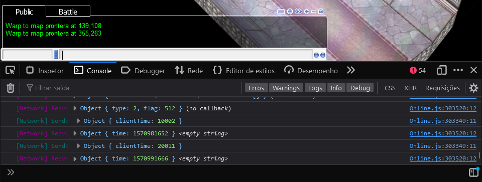
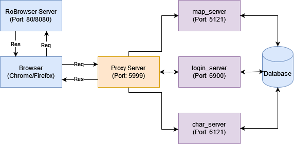
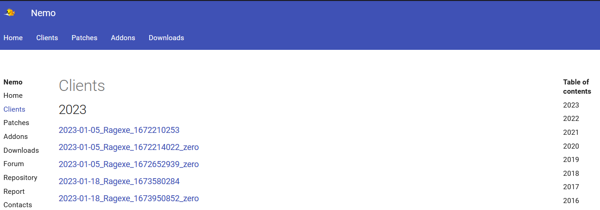
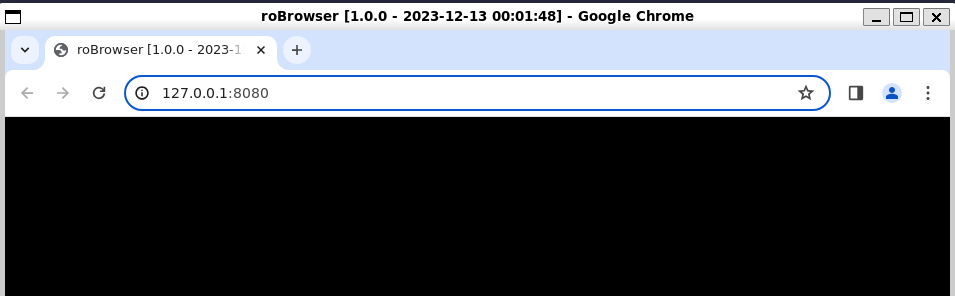

# Getting started

This guide has the goal to help you to Setup/Play RoBrowser. If there's any trouble during the process, please open an [issue](https://github.com/MrAntares/roBrowserLegacy/issues/new) with all your concerns and points to improve.


- [Getting started](#getting-started)
- [1. Important notes before starting](#1-important-notes-before-starting)
- [2. Local Installation](#2-local-installation)
  - [2.1 Prerequisites](#21-prerequisites)
- [3. Setup Instructions](#3-setup-instructions)
  - [3.1 Setup: NodeJS and NVM](#31-setup-nodejs-and-nvm)
  - [3.2 Setup: Node wsproxy](#32-setup-node-wsproxy)
  - [3.3 Setup: Game Files](#33-setup-game-files)
  - [3.4 Setup: Game Server](#34-setup-game-server)
  - [3.5 Setup: RoBrowser](#35-setup-robrowser)
- [4. Serving and Running roBrowser](#4-serving-and-running-robrowser)
  - [4.1 Serving Game: Live Server/Production](#41-serving-game-live-serverproduction)
  - [4.2 Serving Game: Development](#42-serving-game-development)
  - [4.3 Serving Game: using Browser](#43-serving-game-using-browser)
- [5. Add game assets](#5-add-game-assets)
- [6. Adding Custom Plugins](#6-adding-custom-plugins)
- [7. ROBrowser Settings Overview](#7-robrowser-settings-overview)
  - [8. Play the Game](#8-play-the-game)
- [9. Troubleshooting](#9-troubleshooting)
  - [9.1 Troubleshooting: The screen is weird and/or the developer console (F12) says it can't load game assets](#91-troubleshooting-the-screen-is-weird-andor-the-developer-console-f12-says-it-cant-load-game-assets)
  - [9.2 Troubleshooting:  Screen is blank](#92-troubleshooting--screen-is-blank)
  - [9.3 Troubleshooting: AI%5cConst.js (404 not found)](#93-troubleshooting-ai5cconstjs-404-not-found)
  - [9.4 Troubleshooting:  Wrong Response Status - 403 Not Found, 403 Forbidden](#94-troubleshooting--wrong-response-status---403-not-found-403-forbidden)
  - [9.5 Troubleshooting: Other](#95-troubleshooting-other)


# 1. Important notes before starting


In case of any error start by opening developer mode and check the browser `Console` (`F12` or `CTRL+Shift+I` in most browsers). Don't forget to adjust the level filters if you don't see everything. Also worth checking the `Network` tab.


> For public servers using secure web protocols `https` and `wss` is a de-facto must, since most browsers don't allow non-secure websocket calls on the internet anymore.
# 2. Local Installation

This guide section will help you running robrowser locally.

## 2.1 Prerequisites

Here's a list of things that you will need to have for a sucessfull installation and gameplay of your favorite server.

| Item            | Description                                                                                                                                                  |
| --------------- | ------------------------------------------------------------------------------------------------------------------------------------------------------------ |
| RoBrowserLegacy | [Client](https://github.com/MrAntares/roBrowserLegacy) to Run Ragnarok Online on browser                                                                     |
| NodeJS 20+      | [NodeJS](https://nodejs.org/en/download/current) to compile RoBrowser assets                                                                                 |
| wsproxy         | A [Websocket Proxy](https://github.com/herenow/wsProxy#readme) to interligate Login + Server + Map into one endpoint                                         |
| Game Server     | Your Emulator that usually is [rAthena](https://github.com/rathena/rathena) or [Hercules](https://github.com/HerculesWS/Hercules/)                           |
| Game Files      | A [kRO](https://rathena.org/board/topic/106413-kro-full-client-2023-04-04-includes-bgm-rsu/) or any RO installation files to use as your base for the server |
| Browser         | Any browser that is compatible with [OpenGL ES 2.0](https://caniuse.com/?search=opengl) (Requirement for RoBrowser)                                          |
| Embed Server    | Any programming language that has embed servers to use. Example: NodeJS, PHP or Ruby. It's totally up to you.                                                |


Currently tested browsers:

* Chrome: _(Desktop & Mobile)_
* FireFox: _(Desktop & Mobile)_
* Safari: _(Desktop & Mobile)_
* Edge: _(Desktop)_

> Others will probably work as well especially if **Chromium based**, but there might be slight differences.

# 3. Setup Instructions


## 3.1 Setup: NodeJS and NVM
> [!NOTE]
> If you already have NodeJS LTS installed, [skip this step](#RoBrowser).

Make sure you're running NodeJS LTS or 18 above. Validate your version using the command:

```shell
node --version
# v20.10.0 (example output)
```

If your version is minor than 18 you can 

To install NVM you can use the command below:

```shell
curl -o- https://raw.githubusercontent.com/nvm-sh/nvm/v0.39.0/install.sh | bash
```

After you install NVM, reopen your terminal and check if the installation was successful:

```bash
nvm --version 
# 0.39.0
```

Now you need to switch to the appropriate version to run **roBrowser** by using the command:

```bash
nvm install --lts
# Downloading and installing node latest version
# Now using node v20.10.0 (npm v10.2.3)
```

Just to make sure, check if the node changed to the specified version after installation:

```bash
node --version
# v20.10.0
npm --version
# v10.2.3
```

Now you're good to go and compile the needed files to your Ro-Browser application!


## 3.2 Setup: Node wsproxy



To run **roBrowserLegacy** it will be necessary a proxy layer between your browser and the *map_server*, *login_server*, and *char_server*. Instead connect into 3 instances, you will only connect to the main proxy.


To install **wsproxy**, use the command below:

```shell
npm install wsproxy -g
```

For more info read [the wsProxy Readme.](https://github.com/herenow/wsProxy#readme)


## 3.3 Setup: Game Files



All client/packet versions are supported, but the number of missing features increases with higher dates, since we need time to get everything implemented. We advise you to use versions older than `2015` for the best experience, but this is not a restriction, only a suggestion.

The game files needs to match the version/episode that you will play. Due that, we recommend to always start with **kRO Client** or you can choose a different Client dowloading from one of **Hercules assets** on [Nemo](http://nemo.herc.ws/downloads/) website. 

## 3.4 Setup: Game Server

You need a game server that is compatible with the original game. There are many implementations/versions/forks that are compatible, you can use any of them, but we suggest using one of the following two, because we test using these emulators:
  
- [rAthena](https://github.com/rathena/rathena)
- [Hercules](https://github.com/HerculesWS/Hercules/)

> [!WARNING]
> - Disable pincode on the game server. (Not supported yet)
> - Disable packet_obfuscation on the game server. (Not supported yet, causes invalid packets)

## 3.5 Setup: RoBrowser

First, you will need the project in your machine. You can fork your own version or just clone the repository by typing:

```
git clone https://github.com/MrAntares/roBrowserLegacy.git
```

Or you can just download our latest release [here.](ttps://github.com/MrAntares/roBrowserLegacy/archive/refs/heads/master.zip)

Having the project extracted in your machine, you will need to install the node dependencies by running:

```shell
npm install
```


# 4. Serving and Running roBrowser

Now we have everything to make our game run as expected. Before start, we have to start a web-server to host all our roBrowserLegacy. By default, our project already have one installed on the node dependencies, which is called `live-server`, configured under the project's [package.json](../package.json) pre-configured commands.

Running the live server (browserless): 
```bash
npm run live

# robrowser@1.0.0 live
# > live-server . --no-browser
# Serving "." at http://127.0.0.1:8000
```

Or if you're using PHP or Ruby you can type any of these commands:

```shell
php -S 0.0.0.0:8000

# or

ruby -run -ehttpd . -p8000
```

With any of them, you will be able to access `http://localhost:8000` with a proper web-server running locally. 

## 4.1 Serving Game: Live Server/Production

There's two builds available today: Development and Production. 

This step/section is only recommended for a "Live" server. It will only pack all the resource files into one file to speed up loading. 

First, we have to  access the **roBrowserLegacy** project root:

```bash
cd path/to/robrowserlegacy
```

Then you can simply run:
```bash
npm run build -- -O -T -H
```

It will generate 3 files inside `dist/Web`, which are **Online.js**, **ThreadEventHandler.js** and **index.html** that you have to move/copy into your **project root**.

```
cp dist/Web/* .
```

Now you're good to open your browser at `https://127.0.0.1:8000` and see your roBrowser base client running!
> [!TIP]
> In case you want to minify your roBrowser, go on the instance config and turn the `development` flag into `false`.

## 4.2 Serving Game: Development



If you want to contribute directly on RoBrowserLegacy source, you should focus on `/src` path.


First, go to your roBrowserLegacy Folder:

```shell
cd path/to/robrowserlegacy
```

You can start the development build by typing:

```shell
npm run serve
# > robrowser@1.0.0 serve
# > live-server ./dist/Web
#
# Serving "./dist/Web" at http://127.0.0.1:8080
```

Since we're under development purposes (modifying the source/testing) change in the roBrowser config inside the `dist/Web/index.html` with: `development: true`.


## 4.3 Serving Game: using Browser

This step/section is only recommended for a "Live" server. It will only pack all the resource files into one file to speed up loading. Requires to set in the roBrowser config: `development: false,`.

For development purposes (modifying the source/testing) skip this section and set in the roBrowser config: `development: true,`. In development mode roBrowser will use the files directly from `src/`.
- Access `http://localhost:8000/tools/build/index.html` with your browser
  
- Click on "Online", compilation should take around 10~30secs. If it runs longer than 2 minutes there might be an issue.
- Click on "Thread"
- Copy/move the generated files into your web folder (`Online.js` and `ThreadEventHandler.js`)

