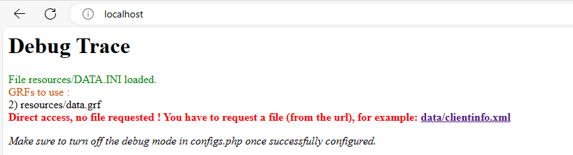

# Remote Client API

The remote client API is responsible to serve the game clients to the roBrowser client. It is responsible to access the
server filesystem, handles the proper encoding to serve the files and it's headers. Also handles the backend for some 
of the tools used in the development process.

## List of Remote Client APIs

Here is a list of Remote Client APIs you can try on. Those are mostly to test purposes, there is no guarantee that the resources
are up-to-date or available all the times.

```
http://grf.robrowser.com/
```

## Self-hosting the Remote Client API

For serving the files, we will be using Apache HTTP server and the [client](../client) directory.

This document assumes that Apache web server is running and properly configured to handle PHP files. Also the modules
rewrite and headers should be enabled.

Copy the files and folders in the [client](../client) directory to the Apache web server root. 

For example, if the web server root is **/var/www/html** the file structure should be:

```
/var/www/html/
├── BGM│
│   └── add-bgm-here.txt
├── Bmp.php
├── Client.php
├── Debug.php
├── Grf.php
├── System
│   ├── add-System-folder-files-here.txt
├── configs.php
├── data
│   ├── add-data-folder-files-here.txt
├── index.php
├── readme.md
└── resources
    ├── .htaccess
```

### Preparing the dependencies

* Copy the files inside the BGM directory from the official game client to the BGM directory inside the web root;
* Copy the files inside the data directory from the official game client to the data directory inside the web root;
  * Any customization files should be here if are not inside a GRF file;
  * You also can extract the data.grf files and place here, but that can take a long time and a lot of disk space;
* Copy the files:
  * DATA.INI
  * data.grf
  from the official game client to the resources directory inside the web root;
    * You can skip this part if you extracted the GRF files to the data directory of the web root;
* Copy the files inside the System directory from the official game client to the System directory inside the web root;


## Testing

After copying the required files, open the [client/configs.php](../client/configs.php) file and change this property:

```php
'DEBUG'               =>     false,
```
to
```php
'DEBUG'               =>     true,
```
Save the file.

Since we are serving the files from the web root directory, open the [client/.htaccess](../client/.htaccess) file and change this property:

```apacheconf
ErrorDocument 404 /client/index.php
```
to
```apacheconf
ErrorDocument 404 /index.php
```
Save the file.

Access your Apache server address and check if a screen with some information appears:



If this screen appears, the Remote Client API is handling the requests properly. Try accessing other files, for example
clientinfo.xml or prontera.gnd.

After finishing the test, open the [client/configs.php](../client/configs.php) file and change this property:

```php
'DEBUG'               =>     true,
```
to
```php
'DEBUG'               =>     false,
```
Save the file.

## Finishing

After the test stage and disabling the debug property, the Remote Client API is ready to serve files to the roBrowser client.

## Troubleshooting

TODO

