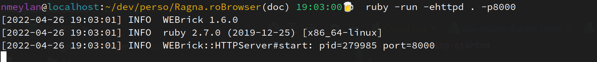
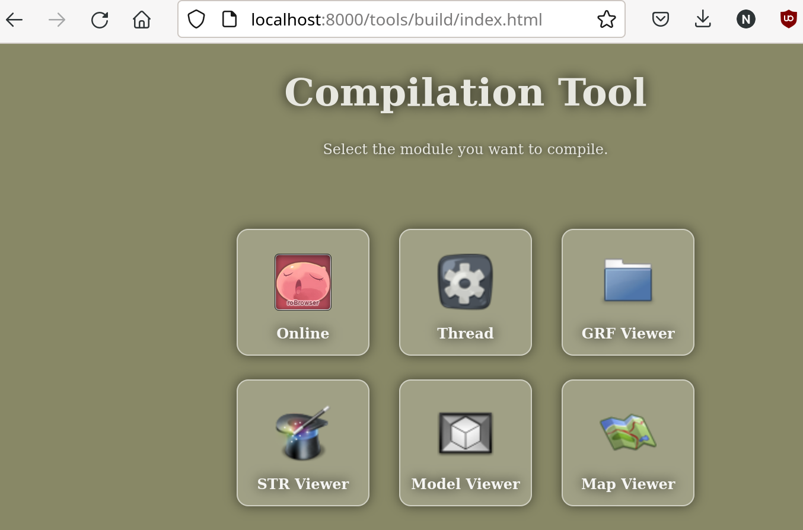
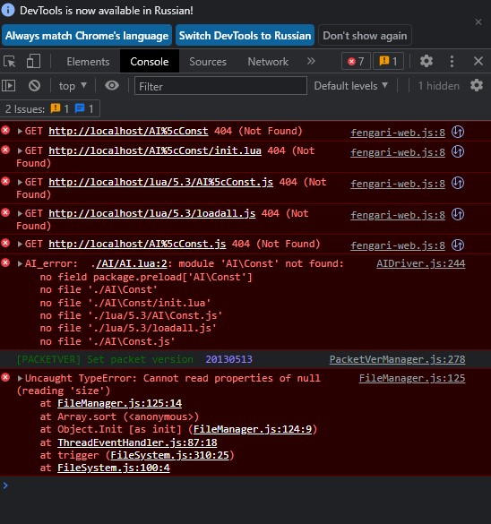

# Getting started

## Important notes before starting
- **In case of any error start by opening developer mode and check the browser `Console` (`F12` or `CTRL+Shift+I` in most browsers). Don't forget to adjust the level filters if you don't see everything. Also worth checking the `Network` tab.**
- **For public servers using secure web protocols `https` and `wss` is a de-facto must, since most browsers don't allow non-secure websocket calls on the internet anymore.**

## Local testing
This guide section will help you running robrowser locally.
### Prerequisite
#### RoBrowser
- Install websocket proxy `npm install wsproxy -g`. For more info read [the wsProxy Readme](https://github.com/herenow/wsProxy#readme)
- Get the source code
  - Either Get the code via GIT
    - HTTPS: `https://github.com/MrAntares/roBrowserLegacy.git`
    - GitHub CLI: `gh repo clone MrAntares/roBrowserLegacy`
  - Or download the [source code](https://github.com/MrAntares/roBrowserLegacy/archive/refs/heads/master.zip) and unpack it to somwehere on your machine.
- Get a web server that supports PHP and .htaccess. Run http server at the root of the roBrowserLegacy directory, or place roBrowserLegacy into your webserver's content directory (use any of [one liner http server](https://gist.github.com/willurd/5720255))

- You own a full client
#### Game Server
- You need a game server that is compatible with the original game. There are many implementations/versions/forks that are compatible, you can use any of them, but we suggest using one of the following two, because we test using these emulators:
  - [rAthena](https://github.com/rathena/rathena)
  - [Hercules](https://github.com/HerculesWS/Hercules/)
- All client/packet versions are supported, but the number of missing features increases with higher dates, since we need time to get everything implemented. We advise you to use versions older than `2015` for the best experience, but this is not a restriction, only a suggestion.
- Disable pincode on the game server. (Not supported yet)
- Disable packet_obfuscation on the game server. (Not supported yet, causes invalid packets)
#### Browser
To run roBrowser you will need an up to date browser that supports [WebGL](http://www.chromeexperiments.com/webgl/) and is OpenGL ES 2.0 compatible. We've tested the following browsers:
* Chrome _(Desktop & Mobile)_
* FireFox _(Desktop & Mobile)_
* Safari _(Desktop & Mobile)_
* Edge

Others will probably work as well especially if Chromium based, but there might be slight differences.

__We assume in the guide below http server to run on port `8000`.__

### Compile files using NPM
This step/section is only recommended for a "Live" server. It will only pack all the resource files into one file to speed up loading. Requires to set in the roBrowser config: `development: false,`.
- Access the RobrowserLagacy Folder using terminal or cmd `cd path/to/robrowserlegacy`
- Use build command to generate the files `npm run build`
- Files will be generated at `dist/Web` folder

For development purposes (modifying the source/testing) set in the roBrowser config: `development: true,`.
- Access the RobrowserLagacy Folder using terminal or cmd `cd path/to/robrowserlegacy`
- Use build command to generate the files `npm run serve`
- Files will be loaded from  at `src/` folder

### Compile files using browser
This step/section is only recommended for a "Live" server. It will only pack all the resource files into one file to speed up loading. Requires to set in the roBrowser config: `development: false,`.

For development purposes (modifying the source/testing) skip this section and set in the roBrowser config: `development: true,`. In development mode roBrowser will use the files directly from `src/`.
- Access `http://localhost:8000/tools/build/index.html` with your browser
  
- click on "Online", compilation should take around 10~30secs. If it runs longer than 2 minutes there might be an issue.
- click on "Thread"
- place `Online.js`and `ThreadEventHandler.js` files under roBrowserLegacy `root` directory

### Add game assets
- copy your `.grf` under `client/resources` directory
- copy your `DATA.INI` (GRF loading order) under `client/resources` directory
- copy your BGM `.mp3` under `client/BGM` directory
- copy your data directory under `client/data`directory
- copy your `clientinfo.xml` (client-server information) under `client/data` directory
- copy your AI files under `AI` directory
- check the `client/configs.php` if it is configured properly for your use and make sure `DEBUG` is set to false
- check the `client/.htaccess` file if the ErrorDocument option points to the `client/index.php` via the correct url. If you don't run roBrowser from the www root and you use remote client then you need to adjust this url (see examples in the file)

In all `AI/*.lua` files :
- Replace all `require "AI\\Const"` with `dofile "./AI/Const.lua"`
- Replace all `require "AI\\Util"` with `dofile "./AI/Util.lua"`

### Plugins
- copy your custom plugins into `src\Plugins` 

Some examples: https://github.com/MrAntares/roBrowserLegacy-plugins

### Configure ROBrowser
- edit `examples/api-online-frame.html`
```js
function initialize() {
      var ROConfig = {
          type:          ROBrowser.TYPE.FRAME,  // Possible: .FRAME (instert into current document), .POPUP (open new window)
          target:        document.getElementById("robrowser"),  // When using TYPE.FRAME this is the id of the target iframe in the current document
          application:   ROBrowser.APP.ONLINE,  // Possible: .ONLINE (game), .MAPVIEWER, .GRFVIEWER, .MODELVIEWER, .STRVIEWER, .GRANNYMODELVIEWER (not implemented)
          width:          800,    // Only affects TYPE.POPUP
          height:         600,    // Only affects TYPE.POPUP
          development:    false,  // When false needs a compiled Online.js in the root (faster load). When true, the client will directly use the javascript files from src/ (slower load, for debugging/development only)
          
          servers: [{  // Game server info. You must configure this! You can have multiple servers like: servers: [{..}, {..}, {..}],
              display:     "Demo Server",  // Display name, can be anything
              desc:        "roBrowser's demo server",  // Description, can be anything
              address:     "127.0.0.1",   // Must match your game server's
              port:        6900,          // Must match your game server's
              version:     25,            // Must match your game server's
              langtype:    12,            // Must match your game server's
              packetver:   20191223,      // Must match your game server's
              renewal:     true,          // Must match your game server's type (true/false). When using clientinfo.xml you can add the <renewal>true</renewal> custom tag.
              packetKeys:  false,         // Packet encryption keys ( not implemented?? )
              socketProxy: "ws://127.0.0.1:5999/",  // The websocket proxy's address you set up previously for robrowser (wsproxy)
              adminList:   [2000000]      // List admins' account IDs here like: [2000000, 2000001, 2000002 .... etc]
          }],
          
          skipServerList:  true,   // Skip server selection?
          skipIntro:       false,  // Skip intor page?
          
          enableCashShop:  false,  // Enable Cash Shop UI?
          
       /* OPTIONAL/CUSTOM CONFIGS */
       /* Add/Remove the below as you wish */
          
          //clientHash:    '113e195e6c051bb1cfb12a644bb084c5', // Set fixed client hash value here (less secure, for development only)
          calculateHash:   false,  // When true, the client will calculate it's own hash and send that value (slower, more secure, only when development is false). Must provide the list of files in hashFiles!
          hashFiles:       ["api.html", "api.js", "Online.js", "ThreadEventHandler.js"],  // List of files to calculate the Hash based on. Add all files your robrowser uses, including your "main page/index.html" where you set up the RoBrowser Config. Only used when calculateHash is true.
          
          /* Plugins */
          plugins:  {
                        /* Syntax */
                        // PluginName: 'Plugin_JS_Path_In_PluginsFolder_Without_Extension',
                        /* Example: */
                        // KeyToMove: 'KeyToMove/KeyToMove',
                    },
          
          /* Custom, "for fun" camera modes */
          ThirdPersonCamera: false,  // When true you can zoom in more and rotate camera around player more freely with mouse
          FirstPersonCamera: false,  // When true you can look from the player's head, like an FPS game and rotate camera without limit
          CameraMaxZoomOut: 5,  // How far can you zoom out the camera, default:5. Note: Extreme values can break camera and/or mouse.
      };
      var RO = new ROBrowser(ROConfig);
      RO.start();
  }
  
  window.addEventListener("load", initialize, false);  // When the webpage loads this will start roBrowser
```
You can set up your own `index.html` / integrate roBrowser into your website as well based on the .examples/ and this example above.

### Start websocket proxy
- run `wsproxy -p 5999 -a 127.0.0.1:6900,127.0.0.1:6121,127.0.0.1:5121`

Again, for more info read [the wsProxy Readme](https://github.com/herenow/wsProxy#readme)!
Also don't forget to start your game server!

Note: Most of the browsers nowadays don't support mixed security, so either use `https` & `wss` everywhere or `http` & `ws`. Some browsers recently started to disable non-secure websocket calls, so `https` & `wss` is highly recommended if you are using roBrowser on a non-local/open server. To start wsProxy in secure mode (`wss`), you need to have the key and chain files for your certificate and use the following command:
- `wsproxy -p 5999 -a 127.0.0.1:6900,127.0.0.1:6121,127.0.0.1:5121 -s -k your/path/to/privkey.pem -c your/path/to/fullchain.pem`

### Enjoy!
- Access to `http://localhost:8000/examples/api-online-frame.html` with your browser
- 


## Troubleshooting

### The screen is weird and/or the developer console (F12) says it can't load game assets
Your remote client is not configured properly.
- Check the `client/configs.php` and make sure `DEBUG` is set to false.
- Check the `client/.htaccess` file if the ErrorDocument option points to the `client/index.php` via the correct url. If you don't run roBrowser from the www root and you use remote client then you need to adjust this url (see examples in the file).

If it is still not working you can try setting `DEBUG` to true and open the `http://localhost:8000/client/index.php` in your browser to see the debug trace. You can also call files directly from your game data to see if they load properly, eg: `http://localhost:8000/client/data/texture/black.bmp`. After debugging set `DEBUG` to false.

### Screen is blank
Check that you don't have an extension using [postMessage](https://developer.mozilla.org/en-US/docs/Web/API/Window/message_event), it will conflict with code in `api.html` which listen for message.

### AI%5cConst.js(404 not found)


You probably forgot the step about `AI` `require` replacement in `Add game assets` section

### ....(403 not found) ... 403 (Forbidden)

You probably have a server security issue if your server is public. Check your certificates and make sure you configured everything to run securely, you provided the required configuration values in `https`/`wss` and that the main page of roBrowser is also opened with `https`. Redirecting every `http` call to `https` on the webserver is also probably a good idea.

### Other
I personally had to disable `metamask` extension.
